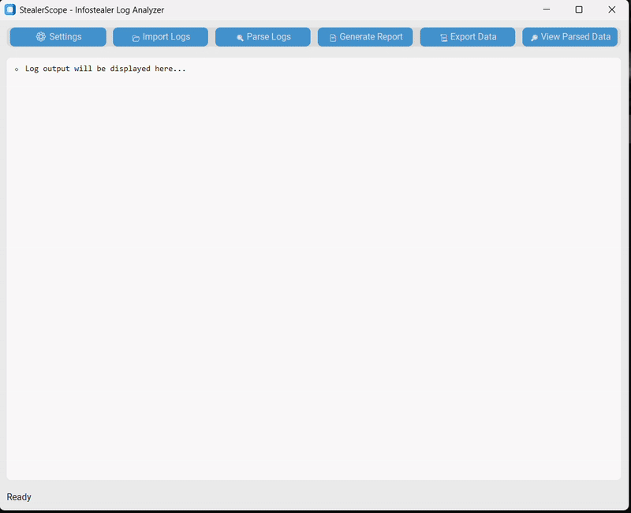

# StealerScope Info Stealer Log Analyzer
StealerScope is a tool designed to analyze log files generated by infostealer malware. It parses and organizes sensitive data such as credentials, brute-force passwords, detected domains, running processes, installed software, and system information into a structured format. With an intuitive GUI, StealerScope allows users to import logs, parse them, generate detailed reports, and export data for further analysis.

🚀 Features
- **Log Parsing**: Stream-processes log files to extract credentials, passwords, domains, processes, software, and system info without loading entire files into memory.
- **GUI Interface**: User-friendly interface built with customtkinter for importing logs, parsing, viewing data, generating reports, and exporting results.
- **Report Generation**: Creates PDF report

🎯 Usage
- **Import Logs**: Use the "📂 Import Logs" button to select a folder containing log files (e.g., all passwords.txt, brute.txt, etc.).

- **Parse Logs**: Click "🔍 Parse Logs" to analyze the imported logs. Progress will be displayed in the log viewer.

- **View Data**: Use "🔎 View Parsed Data" to explore the parsed data in a tree view with filtering options.

- **Generate Reports**: Click "📄 Generate Report" to create a PDF report, or export data as JSON with "📜 Export Data".

- **Settings**: Adjust application settings (e.g., theme, alerts) via the "⚙️ Settings" menu.

📂 Supported Log File Formats

- **all passwords.txt**: Contains credentials (URL, username, password).
- **brute.txt**: Contains brute-force password attempts.
- **domaindetect.txt**: Lists detected domains.
- **processes.txt**: Lists running processes.
- **software.txt**: Lists installed software.
- **system.txt**: Contains system information (key-value pairs).

📄 Requirements
- **Operating System**: Windows (tested on Windows only; may work on macOS or Linux but not verified).
- **Python**: Version 3.8 or higher (recommended: 3.9 or 3.10).
- **pip**: Python package manager (included with Python 3.4+).
- **customtkinter**: For the GUI interface.
- **fpdf**: For generating PDFs.
- **Pillow**

🚀 How to Launch StealerScope
- **Python Main.py**

🤝 Contributing

Contributions are welcome! Feel free to open issues or submit pull requests.

⚠️ Disclaimer

This tool is intended solely for cybersecurity research, threat analysis, and educational purposes. Unauthorized or malicious use of this tool is strictly prohibited.

📜 License

This project is licensed under the MIT License.

# Demo

